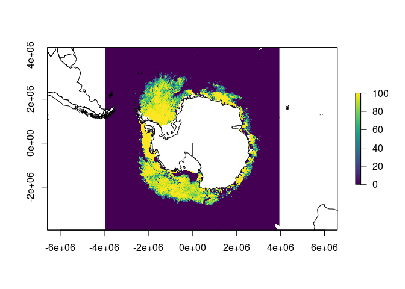

<!-- README.md is generated from README.Rmd. Please edit that file -->
[](https://ci.appveyor.com/project/dis-organization/rgdalwinhdf4)

rgdalwinhdf4
============

The goal of rgdalwinhdf4 is to read HDF4 on Windows, using Appveyor. It works on both 32-bit and 64-bit, relying on Rtools being available, and the [rforge/rgdal](https://github.com/rforge/rgdal.git) clone source with the [rwinlibs/gdal2](https://github.com/rwinlib/gdal2.git) (&gt;= 2.2.3) tooling.

Installation
------------

Until rgdal is on CRAN with version (&gt; 1.2-16) you will need devtools and the Rtools set up on Windows.

(Untested, see this repo appveyor set up for ).

``` r
devtools::install_github("rforge/rgdal/pkg")
devtools::install_github("dis-organization/rgdalwinhdf4")
```

There's a nice HDF4 sea ice data set for testing with.

``` r
## install.packages(c("viridis", "raster", "maptools"))
library(rgdalwinhdf4)
x <- read_hdf4()
#> [1] "/home/rstudio-user/R/x86_64-pc-linux-gnu-library/3.4/rgdalwinhdf4/extdata/asi-AMSR2-s6250-20171211-v5.hdf"
#> [1] ""
#> 
#> 
#> here comes the data!
## system.file("extdata/asi-AMSR2-s6250-20171211-v5.hdf", package = "rgdalwinhdf4")
library(raster)
#> Loading required package: sp
r <- flip(raster(x), "y")
extent(r) <- extent(-3950000, 3950000, -3950000, 4350000)
projection(r) <- "+proj=stere +lat_0=-90 +lat_ts=-70 +lon_0=0 +k=1 +x_0=0 +y_0=0 +a=6378273 +b=6356889.449 +units=m +no_defs"
plot(r, col = viridis::viridis(100))
data("wrld_simpl", package = "maptools")
plot(sp::spTransform(wrld_simpl, projection(r)), add = TRUE)
```



``` r
print(r)
#> class       : RasterLayer 
#> dimensions  : 1328, 1264, 1678592  (nrow, ncol, ncell)
#> resolution  : 6250, 6250  (x, y)
#> extent      : -3950000, 3950000, -3950000, 4350000  (xmin, xmax, ymin, ymax)
#> coord. ref. : +proj=stere +lat_0=-90 +lat_ts=-70 +lon_0=0 +k=1 +x_0=0 +y_0=0 +a=6378273 +b=6356889.449 +units=m +no_defs 
#> data source : in memory
#> names       : layer 
#> values      : 0, 100  (min, max)
```
